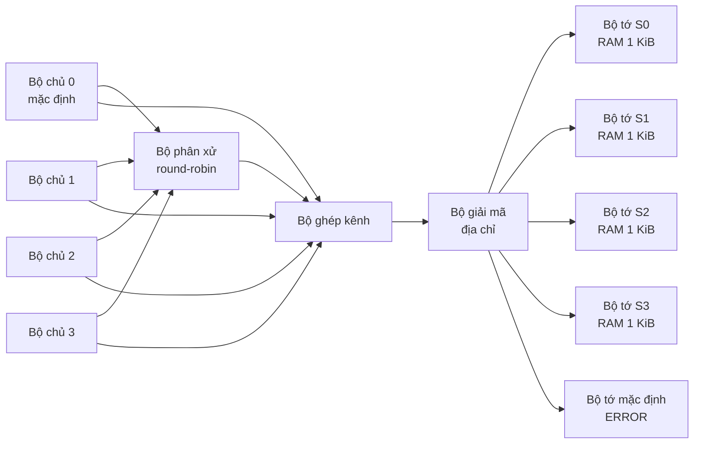

# Thiết kế và mô phỏng AHB theo chuẩn AMBA 2.0

Dự án thiết kế và kiểm thử một hệ thống bus AHB nhiều bộ chủ bằng Verilog, dựa
trên chuẩn **AMBA 2.0**. Mục tiêu là mô phỏng các cơ chế chính của AHB trong
phạm vi phù hợp với bài tập lớn.

Tài liệu tham chiếu: `IHI0011a.pdf` - *AMBA Specification Rev 2.0*.

## Thành viên

| Họ và tên | Mã sinh viên |
| --- | --- |
| Nguyễn Trần An Hưng | 202418911 |
| Hoàng Chí Kiệt | 202418929 |
| Lê Thanh Mai | 202418940 |
| Nguyễn Văn Thế | 202418988 |

## Phạm vi triển khai

Hệ thống hiện hỗ trợ:

- 4 bộ chủ, trong đó bộ chủ 0 là bộ chủ mặc định.
- Phân xử round-robin giữa các bộ chủ đang yêu cầu bus.
- Giao dịch khóa qua `HLOCK` và `HMASTLOCK`.
- Giao dịch đơn `SINGLE` với `HTRANS=NONSEQ`.
- Bus địa chỉ và dữ liệu rộng 32 bit.
- Đọc/ghi byte, nửa từ và từ theo thứ tự little-endian.
- Pipeline pha địa chỉ và pha dữ liệu.
- Giải mã 4 vùng địa chỉ và một bộ tớ mặc định.
- Chèn chu kỳ chờ bằng `HREADY`.
- Phản hồi `OKAY` và phản hồi `ERROR` hai chu kỳ.
- Kiểm tra địa chỉ, kích thước và căn chỉnh giao dịch.
- Testbench tự kiểm tra và xuất dạng sóng VCD.

Các tính năng không triển khai gồm `BUSY`, `SEQ`, chuỗi truyền tăng/vòng,
`RETRY`, `SPLIT` và `HSPLIT`. Đây là lựa chọn phạm vi của bài tập lớn, không phải một
hiện thực đầy đủ của AMBA 2 AHB.

## Kiến trúc



## Cấu trúc thư mục

```text
AMBA-AHB_Verilog/
├── rtl/
│   ├── ahb_defines.v       # Hằng số AHB được sử dụng
│   ├── ahb_master.v        # Máy trạng thái của bộ chủ
│   ├── ahb_arbiter.v       # Phân xử round-robin và khóa bus
│   ├── ahb_mux.v           # Ghép kênh địa chỉ, dữ liệu và phản hồi
│   ├── ahb_decoder.v       # Giải mã địa chỉ bộ tớ
│   ├── ahb_slave.v         # Bộ nhớ bộ tớ và bộ tớ mặc định
│   └── ahb_top.v           # Kết nối toàn hệ thống
├── testbench/
│   ├── ahb_tb.v            # Testbench trên cùng và bộ chạy kiểm thử
│   ├── ahb_tb_tasks.v      # Tác vụ phát lệnh và chờ hoàn tất
│   ├── ahb_tb_monitor.v    # Kiểm tra giao thức dùng chung
│   └── tests/
│       ├── ahb_transfer_tests.v
│       ├── ahb_wait_error_tests.v
│       └── ahb_multimaster_tests.v
└── README.md
```

## Bản đồ địa chỉ

| Bộ tớ | Vùng giải mã | Bộ nhớ mô phỏng hợp lệ | Chức năng |
| --- | --- | --- | --- |
| S0 | `0x0000_0000` - `0x0FFF_FFFF` | `0x0000_0000` - `0x0000_03FF` | RAM vùng 0 |
| S1 | `0x2000_0000` - `0x2FFF_FFFF` | `0x2000_0000` - `0x2000_03FF` | RAM vùng 1 |
| S2 | `0x4000_0000` - `0x4FFF_FFFF` | `0x4000_0000` - `0x4000_03FF` | RAM vùng 2 |
| S3 | `0x6000_0000` - `0x9FFF_FFFF` | `0x6000_0000` - `0x6000_03FF` | RAM vùng 3 |
| Mặc định | Các địa chỉ còn lại | Không có | Trả `ERROR` |

Mỗi bộ tớ RAM có 256 từ 32 bit, tương đương 1 KiB. Địa chỉ nằm trong vùng giải
mã nhưng ngoài 1 KiB bộ nhớ cũng nhận phản hồi `ERROR`.

## Công cụ

- Icarus Verilog 12 hoặc tương đương.
- GTKWave để quan sát dạng sóng.

Trên Ubuntu/Debian:

```sh
sudo apt install iverilog gtkwave
```

## Biên dịch và chạy

```sh
iverilog -g2012 -Wall -I rtl -I testbench -o /tmp/ahb_tb.out \
  testbench/ahb_tb.v \
  rtl/ahb_arbiter.v \
  rtl/ahb_decoder.v \
  rtl/ahb_master.v \
  rtl/ahb_mux.v \
  rtl/ahb_slave.v \
  rtl/ahb_top.v

vvp /tmp/ahb_tb.out
```

Kết quả mong đợi:

```text
TẤT CẢ KIỂM THỬ ĐỀU ĐẠT
```

Chạy riêng từng nhóm kiểm thử:

```sh
vvp /tmp/ahb_tb.out +TEST_TRANSFER
vvp /tmp/ahb_tb.out +TEST_WAIT_ERROR
vvp /tmp/ahb_tb.out +TEST_MULTIMASTER
```

## Xem dạng sóng

Mô phỏng tạo tệp `ahb_wave.vcd` tại thư mục hiện hành:

```sh
gtkwave ahb_wave.vcd
```

Các tín hiệu chính cần quan sát:

```text
HCLK, HRESETn
dut.HBUSREQ, dut.HLOCK, dut.HGRANT
dut.HMASTER, dut.HMASTLOCK
dut.HADDR, dut.HTRANS, dut.HWRITE, dut.HSIZE, dut.HBURST
dut.HWDATA, dut.HRDATA, dut.HREADY, dut.HRESP
dut.hsel_s0, dut.hsel_s1, dut.hsel_s2, dut.hsel_s3, dut.hsel_def
```

## Nội dung kiểm thử

- Đặt lại hệ thống và chuyển bus về bộ chủ mặc định.
- Ghi và đọc lại một từ 32 bit.
- Ghi/đọc byte và nửa từ trên đúng làn dữ liệu.
- Phát hiện địa chỉ không căn chỉnh và kích thước lớn hơn 32 bit.
- Giữ ổn định tín hiệu khi `HREADY=0`.
- Kết thúc trạng thái chờ quá giới hạn bằng `ERROR`.
- Phản hồi `ERROR` đúng hai chu kỳ.
- Phân xử đồng thời giữa ba bộ chủ.
- Giữ quyền sở hữu bus trong giao dịch khóa.
- Báo lỗi với địa chỉ ngoài RAM và địa chỉ của bộ tớ mặc định.
